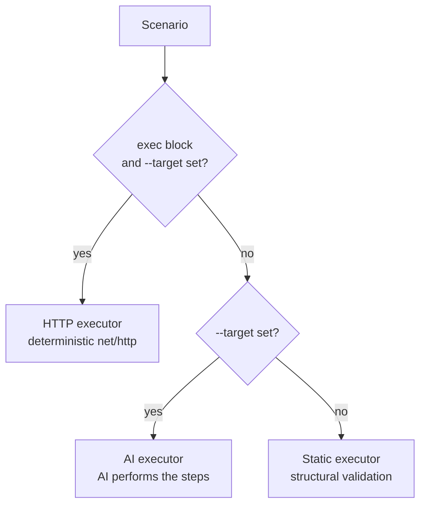

# Execution

> Added in **v0.2**.

By default, `teststop run` **generates** adversarial scenarios and validates them
structurally. Point it at a running system with `--target` and teststop will also
**execute** those scenarios and feed the real pass/fail outcomes into
[confidence memory](memory.md).

This is the jump from a scenario *generator* to a scenario *runner*.

---

## teststop tests what's running — it doesn't run your app

teststop never starts, builds, or manages the system under test. You run your app
however you like — a local process, a container, a staging deployment — and point
`--target` at it:

```bash
teststop run --target http://localhost:8080
```

This is deliberate. teststop is a thin trigger; managing your app's lifecycle
would make it "the new loop that needs maintaining," which the project explicitly
avoids. The upside: you can target **any** environment, including a
production-like instance, and teststop adapts to it.

---

## Hybrid execution

teststop chooses how to execute each scenario individually:



| Condition | Executor | Behavior |
|-----------|----------|----------|
| Scenario has a structured `exec` block **and** `--target` is set | **HTTP** | Fires the exact request with `net/http`; judged on status code |
| `--target` set, scenario is prose-only | **AI-driven** | The AI actually performs the steps against the target and returns a verdict |
| No `--target` | **Static** | Validates scenario structure only (default; ≈ v0.1 behavior) |

The HTTP path is **deterministic and fast** (no AI call at execution time). The
AI path covers open-ended, chaos-heavy scenarios that can't be reduced to one
request. See the [`exec` field](../reference/scenarios.md#exec) for the structured
contract.

### Predicted vs executed

This distinction matters when you read the results:

- **Predicted** (no `--target`) — teststop generates scenarios and validates them
  structurally. Nothing is sent to a system. The report is a **risk surface**, and
  the confidence is labelled **PREDICTED** — it is not evidence of correctness.
- **Executed** (with `--target`) — scenarios are run and judged on real responses.
  Failures are observed, not guessed, and confidence reflects verified behavior.

The JSON output makes this explicit via `exec_summary.executed`. Treat a predicted
run as a checklist of "things that could break a system like this," not a
defect count — run with `--target` to verify which (if any) actually break.

## Concurrency races

A single request can't prove a system is safe against **double-submit** or
**claim-the-last-item** races. Set `concurrency` in the `exec` block and teststop
fires N identical requests simultaneously, asserting the guard lets **at most one
winner** through:

```json
{
  "exec": {
    "mode": "http",
    "method": "POST",
    "path": "/actions/42/approve",
    "expected_status": 200,
    "concurrency": 10
  }
}
```

A **winner** is any `2xx` response (a request that actually succeeded). The bug
teststop detects is **more than one winner** — the guard let concurrent duplicates
mutate state.

- **Pass** — at most one request wins (a `2xx`) and the rest are cleanly rejected
  with a `4xx` (e.g. `409`). Zero winners is also safe (nothing was mutated — e.g.
  an auth endpoint that correctly rejects every concurrent attempt).
- **Fail** — more than one request wins (the race is *not* guarded — the real bug),
  any request returns a `5xx`, or a request fails to complete (transport error).

`expected_status` should be the winner's `2xx` code; it is **not** used to classify
winners, so a rejection code never counts as a success. `actual_behavior` reports
the histogram, e.g. `10 concurrent POST …: 1×200, 9×409`.

!!! warning "Limitation: state setup"
    Race mode fires N identical requests against the target's **current state**. It
    is ideal for guards that don't need per-request setup (create-with-unique-key,
    claim-last-item). Scenarios that must first seed state (approve an action that
    must already be pending) need a setup phase that teststop does not yet provide.

---

## Flags

| Flag | Default | Description |
|------|---------|-------------|
| `--target <url>` | _(none)_ | Base URL of the running system. Empty = static only. |
| `--concurrency <n>` | `4` | Max scenarios executed in parallel |
| `--exec-timeout <dur>` | `10s` | Per-request timeout (`15s`, `500ms`, …) |
| `--max-retries <n>` | `2` | Retries for transport errors and `5xx` responses |

Execution runs concurrently with a bounded worker pool; results are returned in
scenario order.

---

## Sandbox and localhost

teststop runs the AI CLI inside an [Apple Container sandbox](sandbox.md) when
available. A sandboxed container **cannot reach your host's `localhost`**, so:

```bash
# Local target → run the AI tester directly
TESTSTOP_SANDBOX=none teststop run --target http://localhost:8080

# Remote / staging target → sandbox works fine
TESTSTOP_SANDBOX=required teststop run --target https://staging.example.com
```

The deterministic **HTTP executor always runs host-side**, so the sandbox setting
does not affect HTTP-mode scenarios.

!!! info "Future work"
    Wiring the executor to run *inside* the sandbox's network (so even local
    execution is fully isolated) is tracked as a follow-up. Today, use
    `TESTSTOP_SANDBOX=none` for local targets.

---

## What execution looks like

Running against a small Go API:

```bash
TESTSTOP_SANDBOX=none teststop run --path ./sample-api \
  --target http://localhost:8099 --depth light --output json
```

```json
{
  "exec_summary": { "executed": true, "count": 5, "passed": 4, "failed": 1, "target": "http://localhost:8099" },
  "executions": [
    {
      "scenario_id": "login-empty-whitespace-username",
      "area": "api/login",
      "mode": "http",
      "passed": false,
      "actual_behavior": "HTTP 401 in 5ms",
      "failure_reason": "expected status 400, got 401",
      "priority": "medium",
      "duration_ms": 5
    }
  ]
}
```

Here teststop found a real issue: a login with a whitespace-only username was
authenticated (`401`) instead of being rejected as invalid input (`400`). That
failure lowers confidence for the `api/login` area and is reflected in the
[exit code](../reference/exit-codes.md).

---

## Effect on confidence and exit codes

- Each executed scenario updates its `confidence_area`: a **pass** raises
  confidence, a **failure** drops it (see [Memory](memory.md)).
- A failed **`critical`** scenario sets [exit code](../reference/exit-codes.md)
  `2` (do not deploy).
- Below-threshold average confidence sets exit code `1` (review).

Without `--target`, well-formed scenarios pass structural validation, so behavior
matches v0.1.
