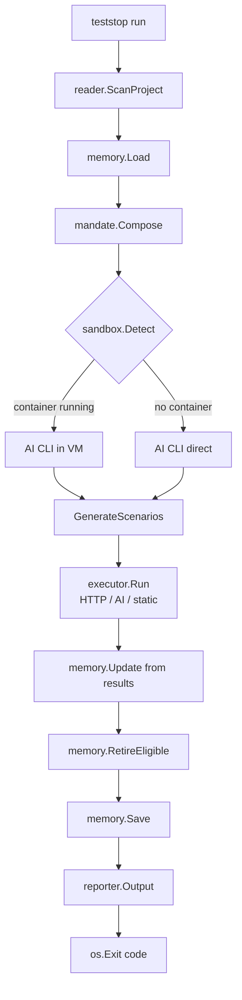

# How It Works

teststop has one job: **trigger AI to test like an adversarial user**. This page explains every step of how it does that.

---

## The Full Pipeline



---

## Step 1 — Scan (`internal/reader/`)

teststop reads your project without executing any code.

### What it detects

The **scanner** (`scanner.go`) walks the project tree, skipping:
`.git`, `node_modules`, `vendor`, `.teststop`, `dist`, `build`, etc.

The **detector** (`detector.go`) identifies:

- **Language** — most files wins; Go beats Python beats TypeScript in ties
- **System type** — checked in priority order:
  `mobile_app` → `data_pipeline` → `cli` → `web_app` → `api` → `library` → `unknown`

The **analyzer** (`analyzer.go`) extracts:

- **Routes & flows** — HTTP handlers, Cobra `Use:` strings, `@app.route`, Express `app.METHOD`
- **Dependencies** — `go.mod`, `package.json`, `requirements.txt`, `Gemfile`, `Cargo.toml`
- **Entry points** — `main.go`, `index.*`, `app.*`, `server.*`

All extracted data populates a `ProjectContext` struct that feeds the mandate.

---

## Step 2 — Load Memory (`internal/memory/`)

teststop reads `.teststop/memory.json` from the project directory.

If the file doesn't exist (first run), it starts with empty memory — all areas at 0% confidence.

The memory tells the mandate composer which areas to focus on:

- **Volatile areas** (< 75% confidence) → test aggressively
- **Stable areas** (≥ 95% confidence) → reduce coverage
- **Retired areas** → skip entirely

---

## Step 3 — Compose Mandate (`internal/mandate/`)

The mandate is the adversarial instruction that transforms a general-purpose AI into a user who tries to break your system.

The composer takes the base mandate (`mandate/base.md`) and replaces nine tokens:

| Token | Replaced With |
|-------|---------------|
| `[SYSTEM_NAME]` | Detected project name |
| `[PROJECT_NAME]` | Project directory name |
| `[DETECTED_LANGUAGE]` | Primary language |
| `[DETECTED_TYPE]` | System type (api, cli, web_app, …) |
| `[DETECTED_ENTRY_POINTS]` | Entry point files |
| `[DETECTED_FLOWS]` | Extracted routes and flows |
| `[MEMORY_STABLE_AREAS]` | Areas with confidence ≥ 95% |
| `[MEMORY_VOLATILE_AREAS]` | Areas with confidence < 75% |
| `[N]` | Scenario count (3–9 based on depth × system type) |

### Scenario count table

| Depth | light | normal | aggressive |
|-------|-------|--------|------------|
| cli / library | 3 | 5 | 7 |
| api / web\_app | 4 | 6 | 9 |
| data\_pipeline / mobile | 3 | 5 | 8 |

See the [mandate deep-dive](../advanced/mandate.md) for how the adversarial patterns work.

---

## Step 4 — Sandbox Detection (`internal/sandbox/`)

teststop checks whether Apple Container is available:

```bash
container system status  # must return "running"
```

| `TESTSTOP_SANDBOX` | Behavior |
|--------------------|----------|
| `auto` _(default)_ | Use container if running; fall back to direct |
| `required` | Error if container not available |
| `none` | Always run AI CLI directly (CI, Linux, Docker) |

In container mode, credentials are mounted read-only:

```
~/.claude       → /root/.claude:ro
~/.config/gh    → /root/.config/gh:ro
```

The AI cannot access anything else on your host.

---

## Step 5 — Generate Scenarios (`internal/ai/`)

teststop shells out to the AI CLI with the composed mandate:

```bash
# Claude
claude -p "<mandate text>"

# Copilot
copilot -p "<mandate text>" -s --no-ask-user
```

The AI returns a JSON array of [Scenario objects](../reference/scenarios.md). teststop strips any markdown fences and parses the JSON.

The AI has a **5-minute timeout** per run.

---

## Step 6 — Update Memory

For each scenario with a `confidence_area` field, teststop updates that area's confidence score.

In v0.1, all generated scenarios count as passes (the execution engine arrives in v0.2). The confidence update formula is:

```
new_confidence = old + 0.19 × (1.0 - old)
```

This is an exponential approach to 1.0 — requiring ~15 passes to reach the retirement threshold of 0.95.

---

## Step 7 — Retire Eligible Areas

Areas meeting both conditions are retired:

- Confidence ≥ 0.95 (95%)
- Test count ≥ 15

Retired areas are written to `.teststop/retired.json` and removed from active testing.
They stay in `memory.json` as a historical record, marked `"retired": true`.

---

## Step 8 — Report & Exit

teststop writes output in the requested format and exits with a [structured exit code](../reference/exit-codes.md):

| Exit Code | Meaning |
|-----------|---------|
| `0` | Confidence threshold met — safe to proceed |
| `1` | Below threshold — review required |
| `2` | Critical failures — do NOT deploy |
| `3` | teststop internal error |

A markdown report is always saved to `.teststop/reports/YYYY-MM-DD-HH-MM-SS.md` regardless of `--output`.

---

## Design Principles

### No code execution
teststop never runs your code. All scanning is static. This is intentional — it keeps teststop universal and safe to run in any environment.

### No new configuration
`teststop run` must work with zero setup. Adding project-specific config defeats the purpose.

### Self-reducing
The test surface shrinks as confidence builds. teststop is designed to be needed less over time, not more.

### Agent-native
Every output (JSON, exit codes, structured fields) is designed to be consumed by AI coding agents, not just humans.
